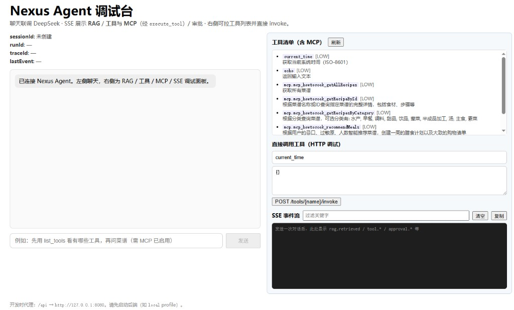
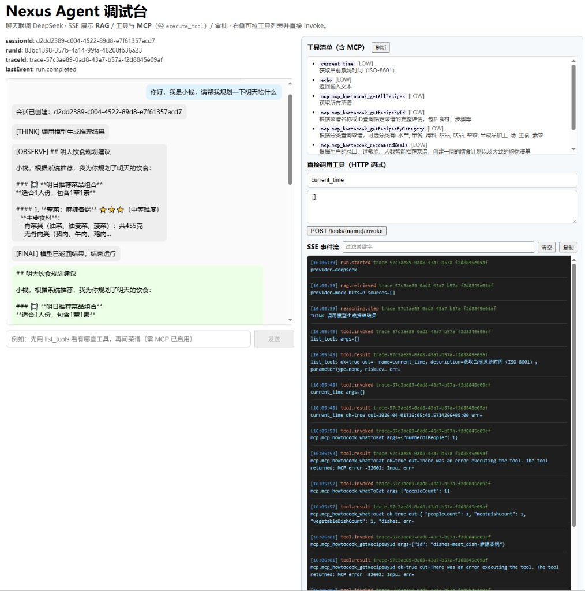
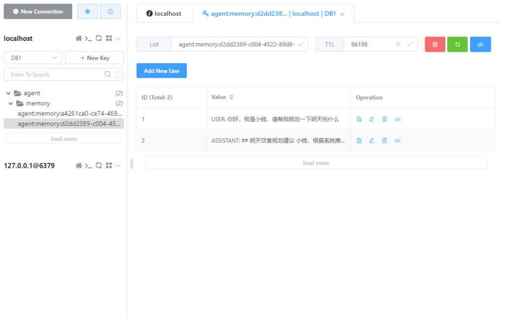
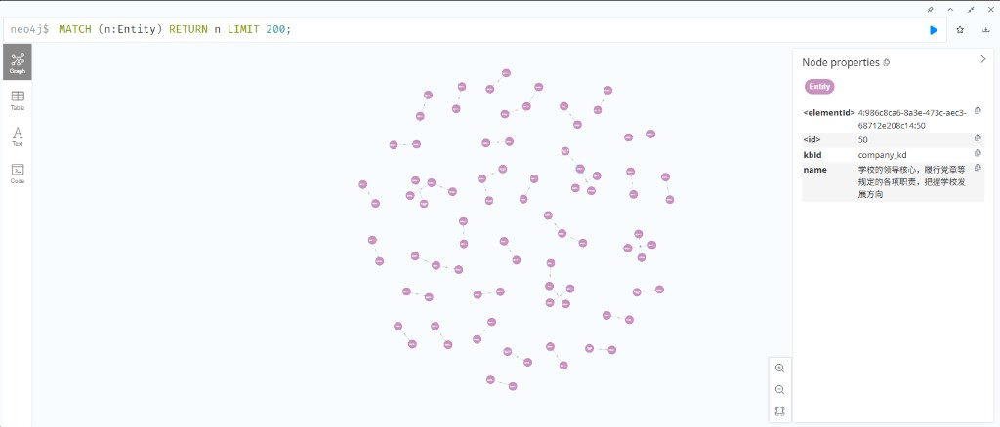

# Nexus-Java 自主 Agent 框架（仓库根）

## 当前进度（与 `docs/plan/work-plan.md` 同步）

- **已完成里程碑**：M1 骨架 → M2 契约 → M3 ReAct v0 → M4 DeepSeek（LangChain4j）→ M5 工具系统 → M5+（`ToolProvider`、Skill 注入、MCP stdio、Function Calling 与工具 SSE）→ M6 工具风险与审批（含单次放行）→ M7 短期记忆滑窗与 **Redis 可切换** → M8a **traceId** 贯穿 SSE → M9a **LLM 熔断** → M10a/M10b **RAG**（检索事件、上下文注入；ES 配置化及基础设施模板预留）。
- **下一阶段**：M10c（向量检索与强过滤）。
- **原则**：契约先行（OpenAPI）、可测试、安全默认（高风险工具走审批）、主链路优先复用 **LangChain4j**（模型 / 工具 / RAG / 记忆）。

### 能力速览

| 模块 | 说明 |
|------|------|
| 后端 `backend/` | Spring Boot 3、REST + **SSE**（`run.started` / `reasoning.step` / `rag.retrieved` / `tool.*` / `approval.*` / `run.completed` 等）、会话与运行、审批 API |
| 模型 | `agent.llm.provider`：`mock` / `deepseek`（OpenAI 兼容），支持 **Function Calling** |
| 工具 | 本地注册工具 + 可选 **MCP**（stdio）；统一 `ToolProvider` 路由；工具风险分级与审批联动 |
| 记忆 | 滑窗上下文；`agent.memory.provider`：**in_memory** / **redis** |
| RAG（Hybrid） | 以 **`docs/design/rag-hybrid-rebuild-spec.md`** 为实施基线：LangChain4j **Advanced RAG**（`RetrievalAugmentor` 编排）；**Chroma** 向量检索 + **Neo4j** 图检索并行召回，聚合去重后注入上下文；分支失败可降级、不阻断 Run。详见下文「RAG 工程」。 |
| 知识库构建 `kb.build` | 可选离线流水线：文档分块、嵌入写入 **Chroma**，结构化三元组写入 **Neo4j**（如 `:Entity` 节点）；与 Hybrid 检索的数据面一致；配置见 `application.yml` |
| 前端 `frontend/` | Vite + React：会话、提交 Run、**SSE 调试面板**（事件过滤、trace、工具列表与调试调用） |
| 契约 | `docs/api/openapi.yaml` 为对外 API 单一事实来源 |

### RAG 工程（与开发文档一致）

本仓库 RAG 侧**不以延续旧版 `mock` / `local_vector` / `elastic` 兼容实现为长期目标**，主链路按 [**RAG 重构技术方案**](docs/design/rag-hybrid-rebuild-spec.md) 落地，并与 [**ragProject（Hybrid 方案摘要）**](docs/design/ragProject.md) 对齐。

**架构要点（LangChain4j Advanced RAG）：**

- **QueryTransformer**：Query2Doc 扩写 + 实体链接，输出多路查询。
- **QueryRouter**：将查询路由到向量与图两类 **ContentRetriever**。
- **ContentRetriever**：**Chroma**（向量 Top-K）与 **Neo4j**（模板 Cypher + 有限跳数路径，MVP 不自由生成 Cypher）。
- **ContentAggregator**：融合、去重、RRF/加权与可选 rerank，再按 `top-k-final` 截断。
- **ContentInjector**：将 Top-N 结果带 **来源元数据**（如 `chunkId` / `source`）注入用户消息。
- **RetrievalAugmentor**：统一编排入口，替代手工拼接 RAG 上下文。

**运行时约束：** 向量与图路径**并行**执行；注入内容须**可追溯**；任一分支失败时**降级**（如 Graph 失败走 Vector-only），双路失败则空上下文继续主链路。可观测性保留 SSE 事件 **`rag.retrieved`**（载荷结构以方案文档第 7 节为准）。

**配置与实施顺序：** 规范化的 `agent.rag.advanced.*` 等配置模型见方案文档 **§6**；开发顺序与验收见 **§9–§10**。

## 本地运行（无 Docker）

1. 启动后端（二选一）：
   - `cd backend && mvn spring-boot:run`
   - 或在仓库根目录：`mvn -pl backend spring-boot:run`  
   （勿在根目录执行无 `-pl backend` 的 `spring-boot:run`，详见 `backend/README.md`）  
   使用 DeepSeek 等真实模型时，建议：`cd backend && mvn spring-boot:run "-Dspring-boot.run.profiles=local"`，并配置 `application-local.yml`。
2. 启动前端：`cd frontend && npm install && npm run dev`（默认 **5173**，通过代理访问后端）。

**细节与配置**（模型 Key、MCP、Redis、ES、基础设施模板等）：见 `backend/README.md` 与 `backend/src/main/resources/application-local-infra.template.yml`。

## 运行效果展示

### 启动页面

### 工作页面

### Redis 记忆存储

### Neo4j 知识图谱（Browser 示例）

下图来自 **Neo4j Browser**：使用 `MATCH (n:Entity) RETURN n LIMIT 200` 查看知识库中的实体节点及其关系（示例数据中 `kbId` 为 `company_kd`）。实际节点属性与规模取决于构建配置与入库文档。

## 文档

- 产品：`docs/prd/prd.md`
- 设计：`docs/design/`（RAG 实施基线：**`docs/design/rag-hybrid-rebuild-spec.md`**；知识库入库：**`docs/design/kb-ingestion-engineering-spec.md`**）
- 计划与里程碑：`docs/plan/work-plan.md`
